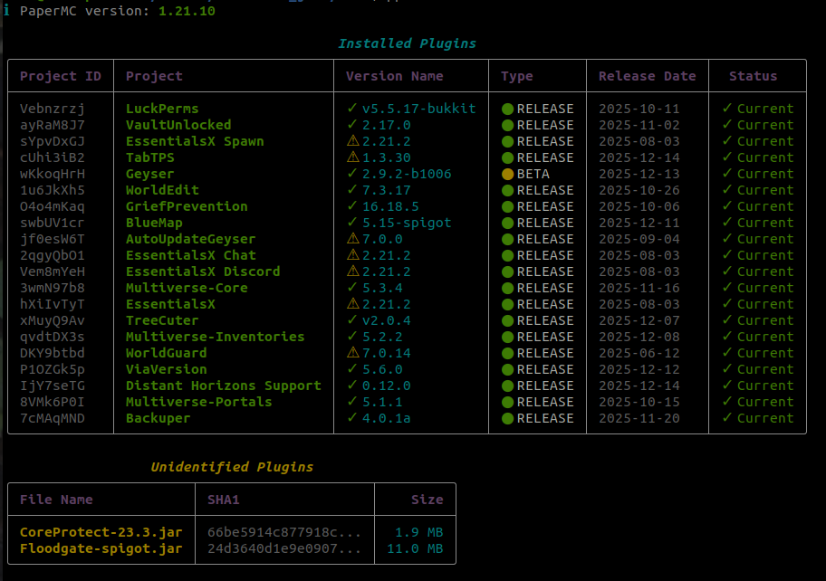
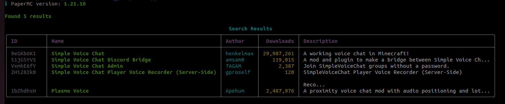
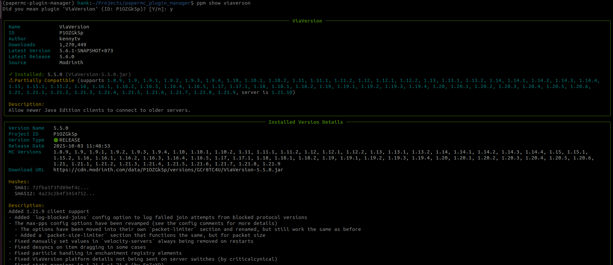

# PaperMC Plugin Manager (ppm)

A modern, user-friendly command-line tool for managing PaperMC server plugins. Built with Python and featuring intelligent caching, automatic updates, and beautiful console output powered by Rich.

## Features

- 🔍 **Smart Search**: Search for plugins across Modrinth with fuzzy matching
- 📦 **Easy Installation**: Install plugins with a single command
- ⬇️ **Version Management**: Upgrade, downgrade, or switch between specific versions
- 💾 **Intelligent Caching**: Fast operations with apt-like cache system
- 🔄 **Version Detection**: Automatically detects outdated plugins
- 📋 **Installation Status**: See which plugins are installed at a glance

## Screenshots

**List installed plugins** - View all installed plugins with version information and update status:


**Search for plugins** - Find plugins across Modrinth with fuzzy matching:


**Show plugin details** - Display comprehensive plugin information including metadata and available versions:


## Installation

```bash
pip install papermc-plugin-manager
```

Or using uv:

```bash
uv tool install papermc-plugin-manager
```